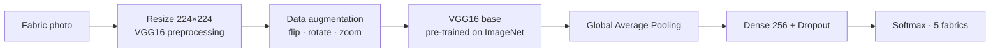

<div align="center">

# 🧵 Fabric Classification with VGG16

**Identify fabric types — cotton, denim, polyester, silk and wool — from a photo,
using transfer learning and fine-tuning on a pre-trained VGG16 network.**


-brightgreen)


[](https://colab.research.google.com/github/YOUR-USERNAME/fabric-classification-vgg16/blob/main/notebooks/fabric_classification_vgg16.ipynb)

</div>

---

## 📌 Overview

Telling fabrics apart is a **texture** problem: the weave of denim, the sheen of silk and the fuzz of wool.
Instead of training a CNN from scratch (which needs thousands of images), this project reuses
**VGG16 pre-trained on ImageNet** — a network that already knows how to see edges, patterns and textures —
and teaches only a small new classifier on top of it. With just **16 images per fabric**, the model reaches
**100% accuracy on held-out test images**.

<p align="center">
  
  <br><em>Samples from the dataset, with their labels</em>
</p>

---

## ✨ Highlights

- 🧠 **Transfer learning** — frozen VGG16 convolutional base + a new 5-class head
- 🎯 **Two-stage training** — feature extraction first, then fine-tuning of VGG16's last block
- 🔄 **Data augmentation** — random flips, rotations and zooms to make the most of a small dataset
- 🏷️ **Automatic labels** — the fabric name is read from the file name (`denim_004.jpg` → `denim`)
- 📦 **Ready-to-use scripts** — `train.py` and `predict.py` for running outside Colab
- 📚 **Beginner-friendly notebook** — every step is explained, starting with a Fashion-MNIST warm-up

---

## 📊 Results

| Metric | Value |
|---|---|
| Classes | 5 (cotton, denim, polyester, silk, wool) |
| Dataset size | 80 images (16 per class) |
| Split (train / val / test) | 56 / 12 / 12 — stratified |
| Input size | 224 × 224 × 3 |
| Trainable parameters (stage 1) | 132,613 of 14.8 M |
| Validation accuracy | **100%** |
| **Test accuracy** | **100% (12 / 12)** |

<p align="center">
  
  <br><em>Accuracy climbs during stage 1 (frozen VGG16), then stays at the top after fine-tuning begins (dashed line)</em>
</p>

### Example predictions

<p align="center">
  
  <br><em>Predictions from the notebook on silk images from the starter dataset, with confidence scores</em>
</p>

> **Note:** The starter dataset is small and its images are clean, uniform texture close-ups, and the test set has only 12 images.
> Expect lower accuracy on real-world photos (different lighting, wrinkles, prints, mixed fabrics).
> Adding more varied images per class is the best way to make the model robust.

---

## 🧠 How it works



| Stage | What is trained | Learning rate | Why |
|---|---|---|---|
| **1. Feature extraction** | Only the new head (VGG16 frozen) | `1e-3` | Learn fabric classes quickly without disturbing VGG16 |
| **2. Fine-tuning** | New head + VGG16 `block5` | `1e-5` | Adapt the deepest features to fabric textures, gently |

Early stopping (`patience=6`, best weights restored) prevents overfitting in both stages.

### Lessons learned

The first version of this project kept predicting **"T-shirt/top"** for every fabric. The model had only ever been trained
on Fashion-MNIST, and the output layer and label list were never changed. Uploading the fabric images
does not teach a model anything — it has to be **trained on them**. The fix, now in this repo:

1. Build a **new output layer with one neuron per fabric** (5, not 10).
2. Create the **label list from the fabric images** instead of reusing Fashion-MNIST names.
3. Use **224 × 224** inputs instead of 32 × 32, so the fabric texture stays visible.
4. Apply the **same preprocessing** at training time and prediction time.

---

## 📁 Project structure

```
fabric-classification-vgg16/
├── notebooks/
│   └── fabric_classification_vgg16.ipynb   # full step-by-step notebook (Colab)
├── src/
│   ├── train.py                            # train the model from a folder of images
│   └── predict.py                          # predict one image or a whole folder
├── dataset/
│   └── README.md                           # dataset layout and how to add fabrics
├── models/
│   └── README.md                           # where to download the trained model
├── images/                                 # figures used in this README
├── requirements.txt
├── LICENSE
└── README.md
```

---

## 🚀 Getting started

### Option 1 — Google Colab (easiest, no setup)

1. Click the **Open in Colab** badge at the top.
2. Set **Runtime → Change runtime type → GPU**.
3. Run the cells from top to bottom and upload the fabric images when asked.

### Option 2 — Run on your computer

```bash
# 1. Clone the repository
git clone https://github.com/YOUR-USERNAME/fabric-classification-vgg16.git
cd fabric-classification-vgg16

# 2. Install the requirements
pip install -r requirements.txt

# 3. Train (put your images in dataset/fabric_dataset_starter first)
python src/train.py --data dataset/fabric_dataset_starter

# 4. Predict a new image, or every image in a folder
python src/predict.py path/to/fabric.jpg
python src/predict.py path/to/folder/
```

Don't want to train? Download the ready model from **[Releases](../../releases)** into `models/` (see [`models/README.md`](models/README.md)).

**Example output** — each line shows the predicted fabric, its confidence, and the next two most likely fabrics in brackets:

```
silk_012.jpg                   -> SILK       (99.65%)   [<2nd fabric> x.x%, <3rd fabric> x.x%]
```

---

## 🛠️ Tech stack

| Tool | Used for |
|---|---|
| TensorFlow / Keras | VGG16, model building, training |
| NumPy | Image arrays |
| Pillow | Loading and resizing images |
| scikit-learn | Stratified train / validation / test split |
| Matplotlib | Plots and visualisation |
| Google Colab | Free GPU for training |

---

## 🔮 Future improvements

- [ ] Collect 100+ real-world photos per fabric (different lighting, colours and angles)
- [ ] Add more fabrics: linen, leather, velvet, nylon
- [ ] Add a confusion matrix and per-class precision / recall
- [ ] Compare with lighter models (MobileNetV2, EfficientNet) for faster predictions
- [ ] Build a simple web demo with Streamlit or Gradio

---

## 👤 Author

**YOUR NAME**
- GitHub: [@YOUR-USERNAME](https://github.com/YOUR-USERNAME)
- LinkedIn: [your-profile](https://www.linkedin.com/in/your-profile)

If you found this project useful, please consider giving it a ⭐!

## 📄 License

This project is licensed under the MIT License — see [LICENSE](LICENSE) for details.
